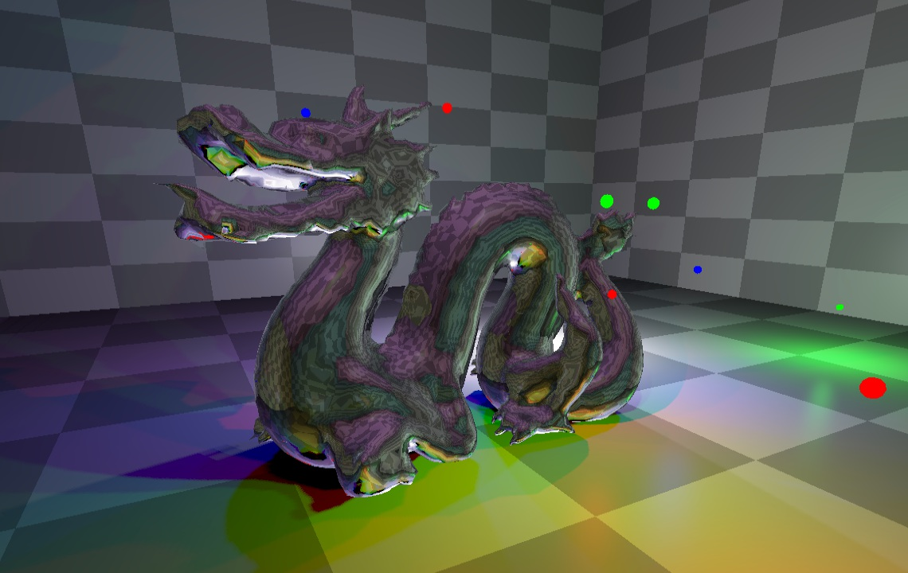

Point Light Shadow & Envmap
===========================

ブログ記事：[【WebGPU】全方位影と映り込みと - Kludge Factory](https://tyfkda.github.io/blog/2023/11/29/paraboloid-shadow-envmap.html)

#### 動画

### 参考

  * ベースにするリポジトリ：[Deferred Rendering & Shadow Mapping](https://github.com/tyfkda/deferred_shadow_mapping)
  * [Game Programming - Dual Paraboloid Shadow Mapping](http://gamedevelop.eu/en/tutorials/dual-paraboloid-shadow-mapping.htm)
  * [t-pot『動的双放物面環境マッピング』](https://t-pot.com/program/55_dpem/index.html)
